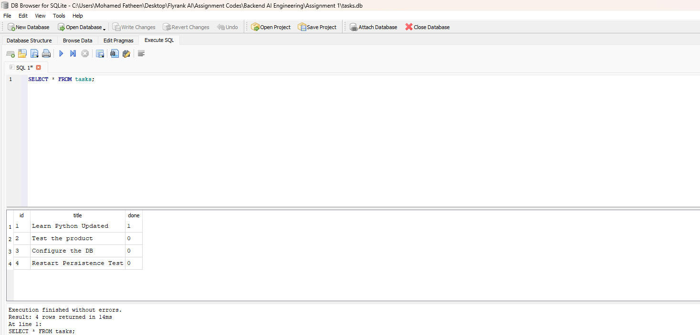
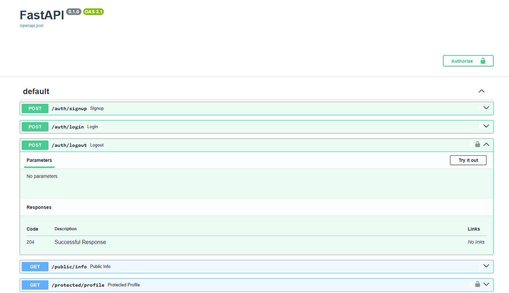

# Task API

A lightweight **RESTful Task Management API** built with **Python** and **FastAPI**.

The API supports the complete CRUD lifecycle for tasks — creating, retrieving, updating, and deleting tasks — with input validation and appropriate HTTP status codes.

## Features

* RESTful API built with FastAPI
* Complete CRUD operations
* Pydantic request validation
* Automatic Swagger/OpenAPI documentation
* Proper HTTP status codes
* SQLite database storage
* Error handling for invalid titles and missing tasks

## Tech Stack

| Technology        | Purpose                       |
| ----------------- | ----------------------------- |
| Python 3.10+      | Programming language          |
| FastAPI           | Web framework                 |
| Pydantic          | Request validation            |
| Uvicorn           | ASGI server                   |
| SQLite            | Database                      |
| Swagger / OpenAPI | Interactive API documentation |

## Getting Started

### 1. Clone the repository

```bash
git clone <https://github.com/HR-Fatheen/Task-API>
```

### 2. Create a virtual environment

**Windows PowerShell:**

```powershell
python -m venv .venv
.\.venv\Scripts\Activate.ps1
```

### 3. Install dependencies

```powershell
pip install fastapi uvicorn
```

### 4. Start the server

```powershell
python -m uvicorn main:app --reload
```

The API will be available at:

`http://localhost:8000`

## API Documentation

FastAPI automatically generates interactive Swagger documentation.

Open:

`http://localhost:8000/docs`

From Swagger UI, you can execute and test all API endpoints directly from your browser.

## API Endpoints

|  Method  | Endpoint      | Description                   |
| :------: | ------------- | ----------------------------- |
|   `GET`  | `/`           | Returns API information       |
|   `GET`  | `/health`     | Returns the API health status |
|   `GET`  | `/tasks`      | Returns all tasks             |
|   `GET`  | `/tasks/{id}` | Returns a task by ID          |
|  `POST`  | `/tasks`      | Creates a new task            |
|   `PUT`  | `/tasks/{id}` | Updates an existing task      |
| `DELETE` | `/tasks/{id}` | Deletes a task                |

## Request Examples

### Create a Task

**POST `/tasks`**

```json
{
  "title": "Buy Milk"
}
```

Example Successful response:

```json
{
  "id": 4,
  "title": "Buy Milk",
  "done": false
}
```

### Update a Task

**PUT `/tasks/{id}`**

```json
{
  "title": "Buy Groceries",
  "done": true
}
```

Example Successful response:

```json
{
  "id": 4,
  "title": "Buy Groceries",
  "done": true
}
```

### Delete a Task

**DELETE `/tasks/{id}`**

Example Successful response:

```json
{
  "message": "Task deleted"
}
```

## HTTP Status Codes

|         Status Code        | Meaning                                    |
| :------------------------: | ------------------------------------------ |
|          `200 OK`          | Request completed successfully             |
|        `201 Created`       | A new task was created                     |
|      `400 Bad Request`     | Task title is missing or empty             |
|       `404 Not Found`      | Requested task does not exist              |
| `422 Unprocessable Entity` | Request body contains invalid JSON or data |

## Data Storage

This project uses **SQLite** for persistent task storage.

SQLite was chosen because it is lightweight, serverless, requires zero separate database setup, and stores the database in a single file. This makes it suitable for this project while still providing persistence across server restarts.

The database is stored locally as:

`tasks.db`

The database file is normally excluded from Git using `.gitignore`.

The database and `tasks` table are created automatically when the application starts. If the table is empty, the application seeds it with three example tasks.

All CRUD operations use SQLite queries with parameterized values.

## Project Structure

```text
Assignment 1/
│
├── main.py
├── database.py
├── README.md
├── .gitignore
├── database-screenshot.png
```

## Example SQL Query

The following query was used in DB Browser for SQLite to verify the tasks stored in the database:

```sql
SELECT * FROM tasks;
```

## SQLite Database

The SQLite database was inspected using DB Browser for SQLite. The screenshot below shows the `tasks` table and the tasks stored in the database.



## Swagger UI

The API was tested using FastAPI's built-in Swagger UI, including the complete CRUD workflow:

**Create → Read → Update → Delete**



## Project Status

**Assignment 2 — SQLite Database Migration**

The API now uses SQLite for persistent task storage. All CRUD operations interact directly with the SQLite database, and task data persists across server restarts.

The project includes:

* Automatic database and table creation
* Initial task seeding
* Full CRUD operations using SQLite
* Parameterized SQL queries
* Input validation and appropriate HTTP status codes
* Swagger/OpenAPI documentation
* DB Browser verification
